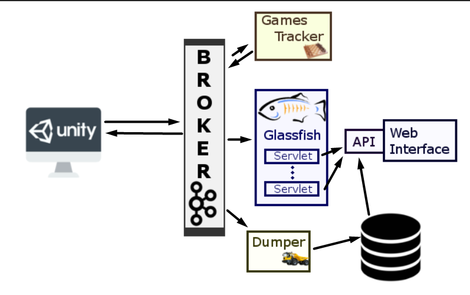
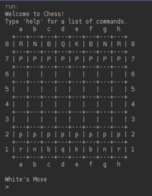
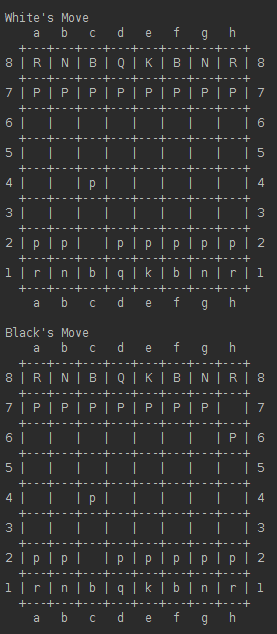
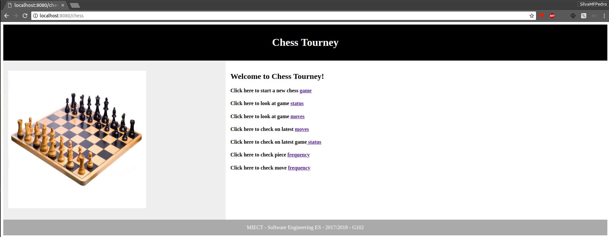

# Chess Tourney
Online multiplayer chess games are very common on the web nowadays. What we aim to attain is a web application where it is possible to play chess against several (simulated or not) players, and also where one can monitor the games (which can happen simultaneously), and see detailed information about each game, like the time each player as spent thinking on his moves, how many moves had they made so far, etc. This type of information can be retrieved from not only the games taking place at the moment, but also the ones that have already terminated (game/tournament history). Each game is a 1 vs 1 game. The games happen in real time, and can happen simultaneously. Each game is timed, meaning, there is a cronometer for every game, to control the time spent and additional time gained by each player. In case of a tournament, as usual, the winner goes on to the next phase until a champion is found.

## Architecture
The architecture can be divided into 3 sections: two smaller sections of interation with the users, and a bigger section that portrays the handling of the data.

 The two smaller sections consist of the Unity application where the games are actually played, and the web interface where users cab see the information about the games/tournaments played on Chess Tourney.

 The third section however is the actual meat of the pie. To handle the complex problem of handling what we have to assume, could an enormous amount of data, we adopt a divide and conquer strategy, aproaching the issue with a micro-services solution. All the information generated by the players using the unity application goes through a broker (in the case of Chess Tourney, we'll be using Kafka) which will then relay to multiple docker containers, which with a specific task, for example, a container that tracks the games being played at the current time, a container that dumps the information into the database, to assure its persistency, or a glassfish container to make the bridge between the previously mentioned web interface and the rest of the system.

## Components

### Unity
The role of Unity is to make players able to play the Chess Game.

### Kafka Broker
This broker is a component that comunicates through a Restful API with other services and its main function is to be a message middleware that handles real-time data (Chess moves from players) from Unity. It reads and writes data of the chess moves and it sends the data to the Glassfish Servlets and Dumper.

### Game Tracker - CLI (Chess Layout Interface)
The purpose of this module is to display the chessboard with the chess-moves being made by the players in Unity. Basically in this module we have two consumers that are consuming data from the Kafka Broker and playing the game on the Game Tracker module according to the received data. This module will be used by the web interface in order to determine the game status as well as other additional information

Play 1           |  Play 2
:-------------------------:|:-------------------------:
  |  

### Web User Interface
- REST API
The Chess Tourney Web Portal is the web interface between the Chess Tourney platform and any person that wants to see a game or tournament. This API uses a REST-ful engine with a set of endpoints(described below) to manage all the information, by collecting data from the GlassFish Servlets and/or Database and displaying it in the WEB API. It can show a specific game beetween two players, chess-moves, frequencies and other devolpments.

As mentioned earlier the API uses a REST-ful engine with a set endpoints that collects data of the Game Tracker module from the Glassfish Servlets and displays it on the web Interface.

This REST-ful engine uses 7 endpoints, each with a specific purpose using the HTTP methods GET, POST and PUT:
